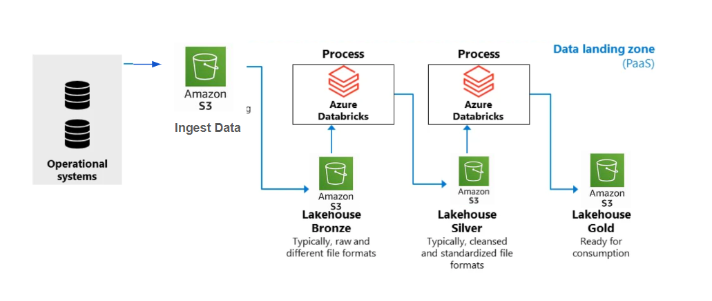
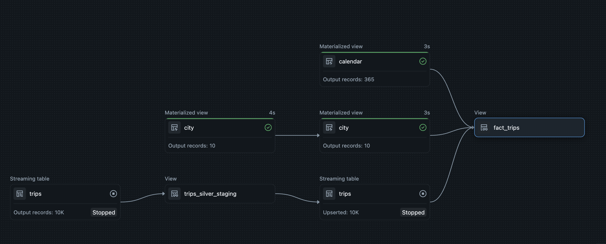

# Spark Lakehouse CDC Pipeline

## 📌 Project Overview

This project implements a production-style Lakehouse data engineering pipeline using Apache Spark Structured Streaming and Delta Lake on Databricks. The system ingests trip data incrementally from Amazon S3, processes it through a Bronze–Silver–Gold medallion architecture, applies data quality validations and Change Data Capture (CDC), and delivers an analytics-ready Gold layer for business intelligence dashboards.

The objective of this project is to simulate real-world modern data engineering workflows including incremental ingestion, schema evolution handling, streaming transformations, and dimensional modeling for BI consumption.

---

## 🏗️ Architecture Overview

The pipeline follows a Medallion Architecture:

**Amazon S3 → Bronze (Raw Streaming) → Silver (Cleaned + CDC) → Gold (Dimensional Model) → Dashboard**

### Architecture Diagram

---

## ⚙️ Tech Stack

- Apache Spark (Structured Streaming)
- Databricks
- Delta Lake
- Auto Loader (cloudFiles)
- Change Data Capture (SCD Type 1)
- Amazon S3 (Data Lake Storage)
- Power BI (Dashboarding)

---

## 🥉 Bronze Layer – Raw Ingestion

- Incremental ingestion from Amazon S3 using Auto Loader
- Schema inference enabled
- Schema evolution handled using rescue mode
- Streaming Delta table for persistent raw storage
- Micro-batch processing for scalability

This layer ensures reliable, fault-tolerant ingestion of newly arriving files without reprocessing historical data.

---

## 🥈 Silver Layer – Data Cleansing & CDC

- Streaming transformations applied using PySpark
- Data quality expectations enforced (valid dates, rating range checks)
- Standardization of categorical fields
- CDC upsert logic implemented using `create_auto_cdc_flow`
- SCD Type 1 handling using `trip_id` as primary key
- Sequencing applied to retain the latest record version

This layer ensures clean, validated, and up-to-date curated data.

---

## 🥇 Gold Layer – Dimensional Modeling

- Star-schema inspired modeling approach
- Fact table: `fact_trips`
- Joined with:
  - City dimension
  - Calendar dimension
- Time-based analytics enabled (month, quarter, week, holiday flags)
- Optimized for BI consumption

The Gold layer delivers analytics-ready datasets for reporting and decision-making.

---

## 📊 Dashboard Visualizations

Three dashboards were built using the curated Gold layer:

### Executive Overview

  

### OPERATIONAL Overview

  

### REGIONAL Overview

  

The dashboards highlight:
- Total trips and total revenue
- Revenue and trip distribution by city
- Time-based trends and seasonality
- Passenger behavior patterns
- Driver and passenger rating insights

---

## Incremental Streaming Demo

The demo below shows 10,000 new records being dropped into Amazon S3 and incrementally processed through the Bronze → Silver → Gold pipeline without reprocessing historical data.

---

## 🚀 Key Engineering Highlights

- Incremental streaming ingestion using Auto Loader
- Schema evolution handling
- Data quality validation using declarative expectations
- CDC upserts with SCD Type 1 logic
- Medallion architecture implementation
- Dimensional modeling for analytics
- End-to-end validation from cloud storage to dashboard

---

## 🔮 Future Enhancements

- Partition optimization strategy
- Delta table performance tuning (Z-order, OPTIMIZE)
- Aggregated Gold marts for faster dashboard queries
- Workflow orchestration using scheduled jobs
- CI/CD-based pipeline deployment

---

## 📎 Conclusion

This project demonstrates modern Lakehouse data engineering principles including streaming ingestion, CDC processing, medallion architecture, and analytics-ready data modeling. It reflects real-world scalable design patterns used in enterprise data platforms.

Sahil Chakraborty ✨
